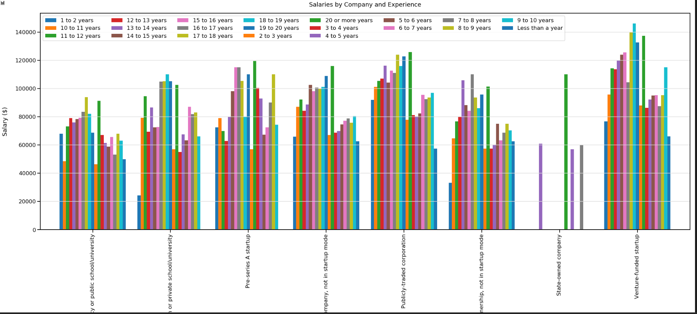
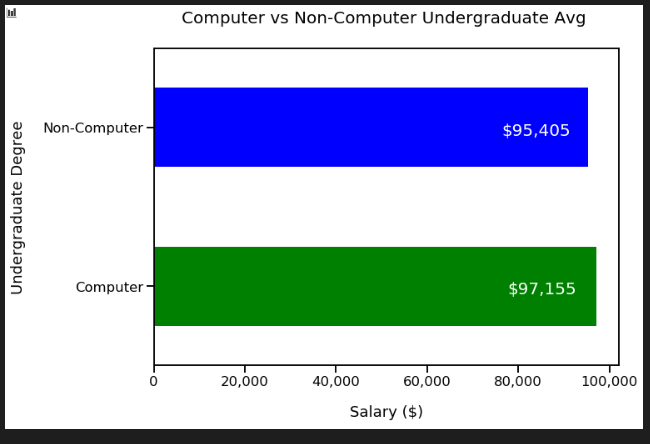

# Jupyter Notebook Examples

<p>
Use this project repo to share Jupyter Notebook examples. The goal here is to show how SQL like expressions can be done with Python and Dataframe expressions (Panda). We also want to compare some of these charts with how they could be done using PowerBI.

## Example Library

### Clustered Chart

```python

# get the exoerience information
# group by company and experience then get the avg salary
# unstack the results to move the experience as columns to create the series
experience = dfValidCompanies.groupby(["CompanyType","YearsProgram"])['Salary']
    .mean().rename("Salary")
    .sort_values(ascending=False).sort_index()
    .unstack()
    
experience.head()

# create the clustered chart
sns.set_context('talk')
plot = experience.plot.bar(figsize=(35, 12), width=.85)
plot.legend(loc="top",ncol=len(experience))
plot.set_xlabel('Company Types', labelpad=20)
plot.set_ylabel('Salary ($)', labelpad=20)
plot.set_title('Salaries by Company and Experience', pad=20)
plot.yaxis.grid(True, color='#DCDCDC')
plot.xaxis.grid(False)

```




### Horizontal Bar Chart

```python


# for each row, check of the MajorUndergrad is computer related
def isComputerRelated(row):
    value = row["MajorUndergrad"].lower()
    return "Computer" if value.find("computer") > -1  else "Non-Computer"

dfCompRelated = dfUSA[["Salary","MajorUndergrad"]].copy()   # get a copy of the dataframe and add the ComputerRelated column
dfCompRelated["ComputerRelated"] = dfCompRelated.apply(isComputerRelated, axis=1)  #apply a function call to each row
compRelAvg = dfCompRelated.groupby("ComputerRelated")['Salary'].mean().sort_values(ascending=False)  # get the avg for each category

# horizontal bar chart with colors
plot = compRelAvg.plot(kind='barh', figsize=(10, 7), color=['g','b'])

# set the axis and title labels
plot.set_ylabel('Undergraduate Degree', labelpad=20)
plot.set_xlabel('Salary ($)', labelpad=20)
plot.set_title('Computer vs Non-Computer Undergraduate Avg ', pad=30, fontsize=20)
plot.set_xticklabels(['{:,.0f}'.format(v) for v in plot.get_xticks()])  # format the x series

# annotate the bars with the total amount
for p in plot.patches:
    b = p.get_bbox()        
    value = "${:,.0f}".format(b.x1)
    # plot.annotate(str(value), (b.x1, b.y1 + -.2 ), fontsize=20)
    plot.text(b.x1 * .80, p.get_y()+ .2,str(value), fontsize=20, color='#ffffff')   # add a value at the end of the bar

```



### Horizontal Bar Chart with Annotations and Sorting

Use: <a href="yearsOfExperienceAnalysis.ipynb">yearsOfExperienceAnalysis.ipynb</a>

```python


# for each row, transform MajorUndergrad to computer or non-computer
def isComputerRelated(row):
    value = row["MajorUndergrad"].lower()
    return "Computer" if value.find("computer") > -1  else "Non-Computer"

# transformed the yearsProgram to a numeric series to allow for sorting
def setExperienceOrder(row):
    value = row["YearsProgram"][0:2].lower().strip()
    return 0 if value.find("le") > -1  else int(value)

dfCompRelated = dfUSA[["Salary","MajorUndergrad", "YearsProgram"]].copy()
dfCompRelated["ComputerRelated"] = dfCompRelated.apply(isComputerRelated, axis=1)  # add the computer related column

# group by yearsprogram and computer related. By default, the new column is index. remove the index.
# Also move the computer related rows to column (unstack) 
compRelAvg = dfCompRelated.groupby(["YearsProgram","ComputerRelated"], as_index=True)['Salary'].mean().unstack().reset_index()
compRelAvg["ExperienceOrder"] = compRelAvg.apply(setExperienceOrder, axis=1)  
compRelAvg = compRelAvg.sort_values(by='ExperienceOrder', ascending=True)

# horizontal bar chart with colors
plot = compRelAvg.plot(kind='barh',x="YearsProgram",y=['Computer','Non-Computer'],figsize=(20, 30), color=['g','b'], width=.8)

# set the axis and title labels
plot.set_ylabel('Undergraduate Degree', labelpad=20)
plot.set_xlabel('Salary ($)', labelpad=20)
plot.set_title('Computer vs Non-Computer Undergraduate Avg ', pad=30, fontsize=20)
plot.set_xticklabels(['{:,.0f}'.format(v) for v in plot.get_xticks()])  # format the x series

# annotate the bars with the total amount
for p in plot.patches:
    b = p.get_bbox()        
    value = "${:,.0f}".format(b.x1)
    # plot.annotate(str(value), (b.x1, b.y1 + -.2 ), fontsize=20)
    plot.text(b.x1 * .75, p.get_y() + .1 ,str(value), fontsize=20, color='#ffffff')   # add a value at the end of the bar

```

