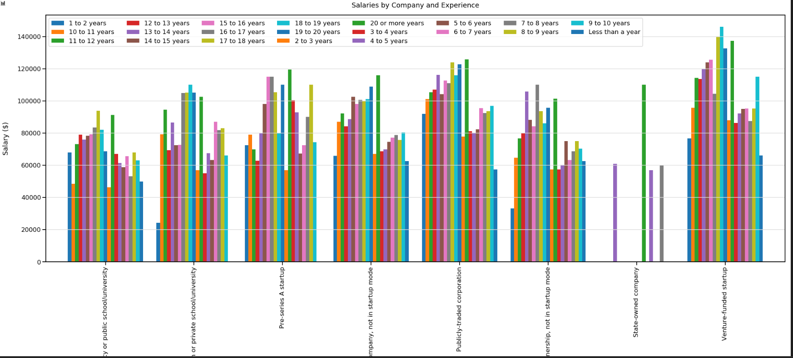

# Jupyter Notebook Examples

<p>
Use this project repo to share Jupyter Notebook examples. The goal here is to show how SQL like expressions can be done with Python and Dataframe expressions (Panda). We also want to compare some of these charts with how they could be done using PowerBI.

## Example Library

### Clustered Chart

```python

# get the exoerience information
# group by company and experience then get the avg salary
# unstack the results to move the experience as columns to create the series
experience = dfValidCompanies.groupby(["CompanyType","YearsProgram"])['Salary'].mean().rename("Salary").sort_values(ascending=False).sort_index().unstack()
experience.head()

# create the clustered chart
sns.set_context('talk')
plot = experience.plot.bar(figsize=(35, 12), width=.85)
plot.legend(loc="top",ncol=len(experience))
plot.set_xlabel('Company Types', labelpad=20)
plot.set_ylabel('Salary ($)', labelpad=20)
plot.set_title('Salaries by Company and Experience', pad=20)
plot.yaxis.grid(True, color='#DCDCDC')
plot.xaxis.grid(False)

```


